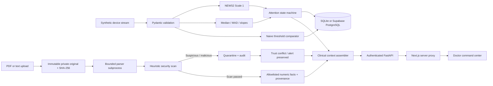

# VITALIS architecture

VITALIS is one clinical workflow: live physiology produces deterministic assessments, while a document gateway controls the historical context visible beside that assessment. External records have no authority to change scoring, attention state, or alert acknowledgement.

## Runtime

- One Next.js frontend, one FastAPI process, one database. One-second browser polling; each backend tick emits eight complete observations. Default two-second ticks represent one **simulated minute**. Clinical timestamps can therefore be ahead of wall time; audit timestamps remain wall time.
- Use **one backend worker / one replica**. The simulator, rolling windows, state machine counters and metrics have one owner. An RLock serializes state mutation; SQLAlchemy transactions commit observations, assessments, alerts and checkpoints together. On transaction failure the in-memory checkpoint rolls back.
- Database checkpoints restore the same run after restart. The 30-sample normal seed window establishes patient-specific baselines, and is excluded from comparison metrics. Warm-up observations are still persisted.
- Reset archives the run and creates another. It does not delete documents, observations or audit records. The UI shows the current run; prior data remains in the database.
- No LLM, external model API, embeddings or autonomous clinical agent is used. Explanations are deterministic templates over typed measurements and computed factors.

## Clinical intelligence

The arithmetic implements adult NEWS2 **SpO₂ Scale 1**. Complete integer heart rate, saturation, respiration and systolic BP; temperature at 0.1 °C resolution; explicit consciousness (ACVPU) and supplemental oxygen are required. Missing, out-of-range, duplicate and out-of-order observations are rejected. Scale 2 is deliberately unsupported: no patient with a clinician-prescribed Scale 2 target is simulated.

Reference: Royal College of Physicians, [NEWS2 official resources](https://www.rcp.ac.uk/resources/national-early-warning-score-news-2/) and [original scoring chart](https://www.rcp.ac.uk/media/alxev00t/news2-chart-1_the-news-scoring-system_0_0.pdf). The app implements the published arithmetic; its remote-monitoring workflow and personalization are not clinically validated.

| Layer                   | Implementation                                                                                                           |
| ----------------------- | ------------------------------------------------------------------------------------------------------------------------ |
| Baseline                | Median of up to 30 accepted normal observations; at least 10 for personalization                                         |
| Spread                  | `max(1.4826 × MAD, vital-specific minimum spread)`                                                                       |
| Deviation               | `(current − median) / spread`; flag absolute robust Z ≥ 3                                                                |
| Trend                   | Least-squares slope over up to 10 timestamped observations; displayed as a window trend, not continuous monotonic change |
| Immediate severity      | NEWS2 ≥ 7 → CRITICAL; NEWS2 ≥ 5 or any component = 3 → at least WARNING, on the first sample                             |
| Experimental candidates | Three abnormal vital deviations → WARNING; lesser NEWS2 points or two deviations → WATCH                                 |
| Persistence             | Experimental upward candidates require 3 consecutive observations                                                        |
| Recovery                | 5 consecutive lower-candidate observations before lowering attention state                                               |
| Missing-data gap        | Gaps over 3 clinical minutes reset trend and persistence windows; previous attention retained until assessed             |
| Adaptation protection   | Baselines freeze at the first abnormal candidate, including before persistence confirmation                              |

The state machine never suppresses an immediate NEWS2 trigger. Acknowledgement records clinician review but does not alter physiological state. Risk and baseline details remain visible even when a transient change does not produce a new attention event.

## Alert comparison

Both engines see identical observations. Naive notifications count **each out-of-range parameter on every sample**. VITALIS counts **each upward attention transition**, including Watch, once. The UI also reports distinct naive alerting patient-samples so the unit difference is explicit.

`reduction = 100 × (1 − VITALIS events / naive parameter alerts)` when the denominator is positive. Values are run-derived, not fixed demo counters. The labelled deterioration episode begins when the operator presses Start deterioration. Detection means first WARNING/CRITICAL for that patient after onset. Delay is simulated minutes, not a claimed predictive lead time. False positives count events outside the labelled synthetic episode. These metrics are scenario demonstrations, not sensitivity/specificity estimates.

Processing p95 measures scoring and SQL writes before transaction commit, excluding network and browser latency. The analytics screen separately displays the measured dashboard request round trip and polling delay. Neither is presented as medical-device end-to-end latency.

## Data model

Eleven tables: patients, demo_runs, vitals_readings, patient_baselines, risk_assessments, alerts, documents, document_scans, extracted_clinical_facts, document_raw_text, audit_events. Device identity is represented by the deterministic synthetic patient source rather than an unused devices table. JSONB on PostgreSQL; JSON on SQLite. Foreign keys and parameterized SQLAlchemy operations protect relational integrity. A unique index prevents duplicate patient/run/timestamp readings.

Supabase tables enable RLS and revoke all anon/authenticated grants; no permissive browser policies exist. Only the backend holds a PostgreSQL connection. A provisioned backend role must have suitable access; the frontend never receives a database key. The migration has not been applied to an unrelated cloud project.

## Document gateway and trust boundary

1. Same-origin frontend mutation check and backend authorization.
2. Bounded request bodies, accepted `.pdf`/`.txt` types, PDF magic-byte validation, UTF-8 validation and 5 MB limit.
3. UUID filename and exclusive file creation. Preserve exact bytes; store SHA-256. User-supplied names are display metadata only.
4. Parser runs in a short-lived process with no application secrets, a 10-second deadline, 20-page/100,000-character limits, and Linux CPU/memory limits. Windows has the deadline and content limits but not the Linux resource caps. At most two document scans per process run concurrently.
5. Detect role impersonation, instruction override, suppression, tool invocation, exfiltration, encoded instructions, invisible Unicode and suspicious PDF text/annotations/actions. PDF actions, links and embedded files are never executed or fetched.
6. Any suspicious/malicious result, insufficient text or parsing failure fails closed into quarantine. The complete document is excluded; no destructive sanitization occurs.
7. Extract only whole-line numeric hemoglobin, potassium and creatinine facts with exact units, plausible bounds, page/line provenance and unverified status. Facts from quarantined documents are retained for inspection but never admitted to context.
8. The context assembler separately exposes computed physiology and screened historical facts. It cannot invoke the risk engine with document prose. A blocked record plus an active non-normal state creates a trust conflict. Upload and escalation events record preservation of the clinical alert.

## Deliberate limits

This is a synthetic adult demonstration, not a medical device. No clinical validation, diagnosis, HIPAA certification, FDA approval, guarantee of protection, or patient outcome claim is made. Heuristics have false positives and false negatives; arbitrary factual medical data poisoning is not solved by injection detection. Even missed directives cannot modify scoring because there is no instruction execution path. Screened numeric facts remain unverified, historical data.

The prototype is single-clinician and single-process. Before real use: identity/tenant authorization, reviewed clinical protocols, authenticated device ingestion, validated timestamp/quality handling, formal parser isolation, tamper-evident audit storage, retention/privacy controls, rate limits, load testing, restore drills and external clinical/security review are required.
